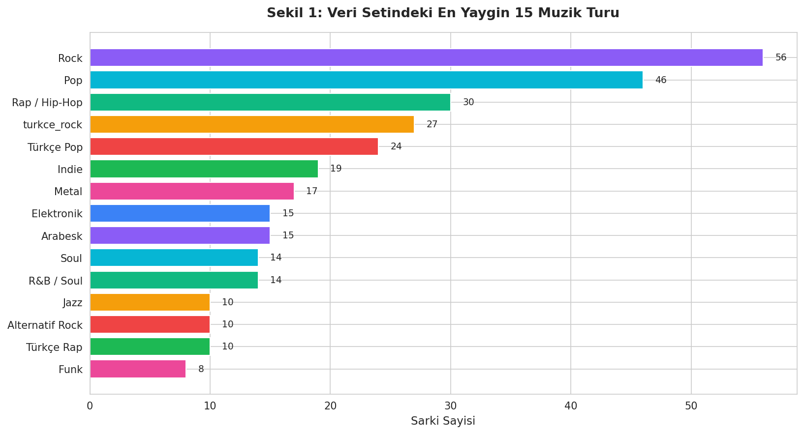
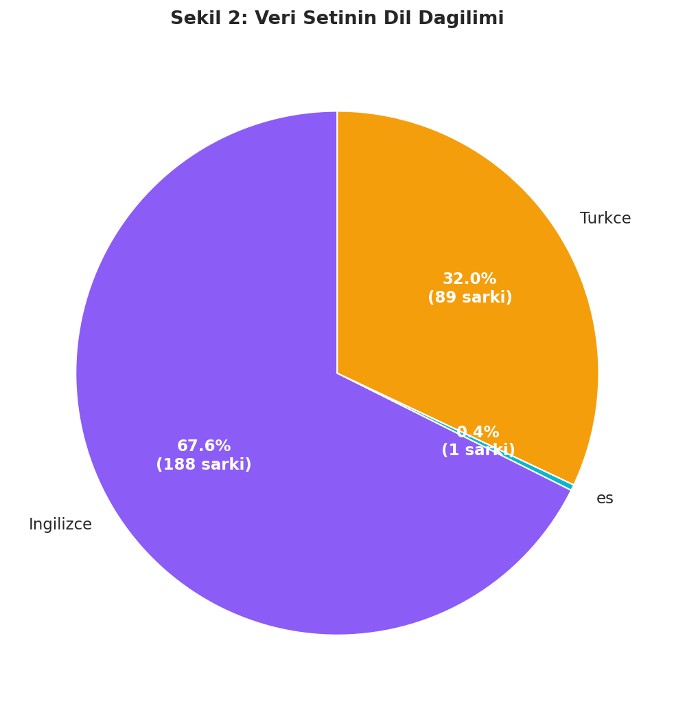
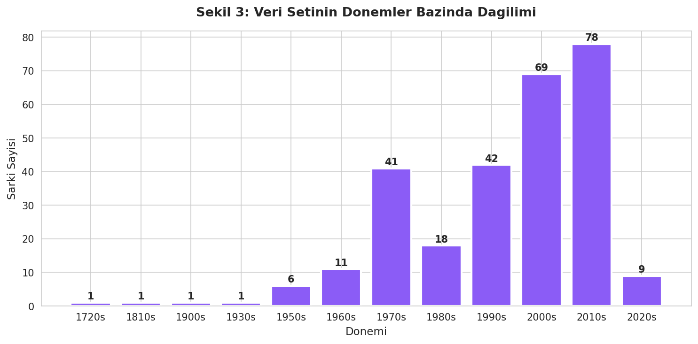
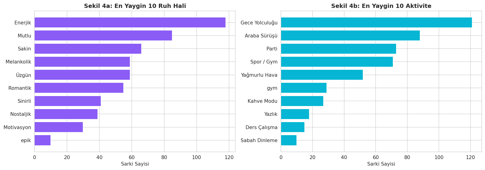
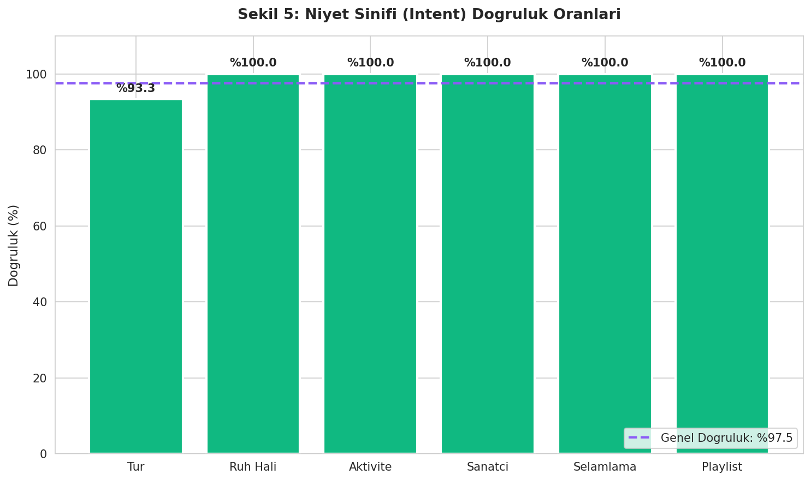
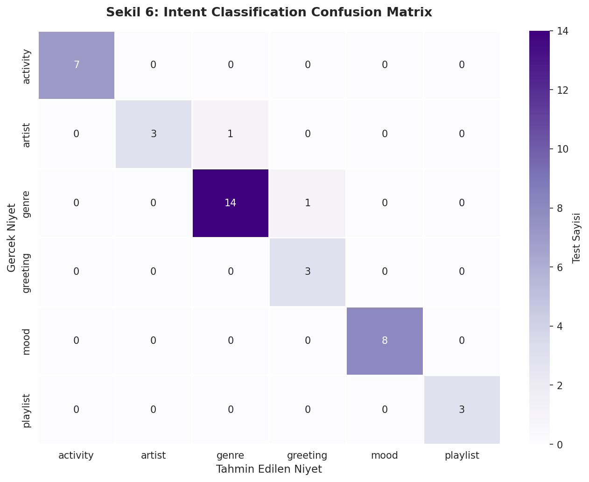
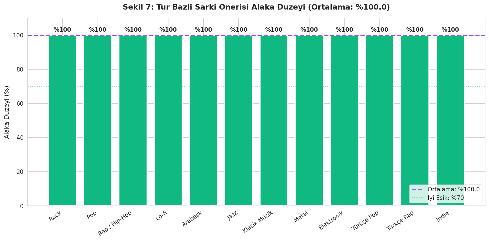
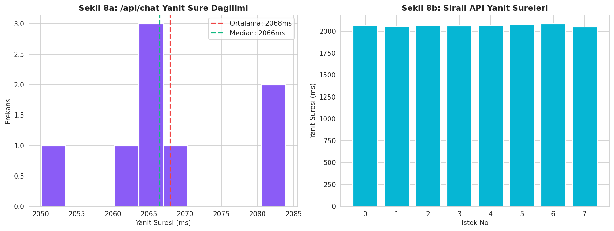
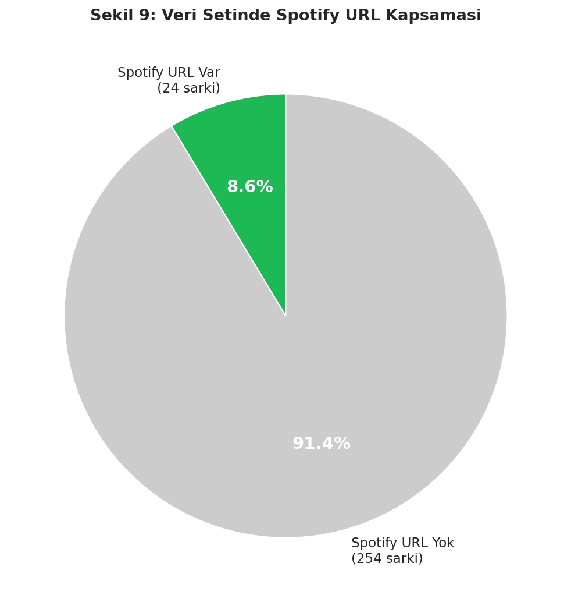

# DJ AI - Proje Sonuc Raporu

**Olusturma Tarihi:** 14 May 2026, 19:52

---

## 1. Ozet

| Metrik | Deger |
|--------|-------|
| Toplam Sarki | 278 |
| Unique Sanatci | 96 |
| Mevcut Tur | 39 |
| Intent Classification Dogrulugu | %97.5 |
| Turkce Ek Isleme Dogrulugu | %86.67 |
| Sarki Onerisi Alaka Duzeyi (Ort.) | %100.0 |
| Ortalama API Yanit Suresi | 2068 ms |
| API Basari Orani | %100.0 |
| Spotify URL Kapsamasi | %8.63 |

## 2. Veri Seti Istatistikleri

## 3. Intent Classification Sonuclari

Toplam **40 test** ile sistemin niyet tespit dogrulugu olculmustur. 
Genel dogruluk: **%97.5**

### Kategori Bazli Dogruluk

| Kategori | Basarili | Basarisiz | Dogruluk |
|----------|----------|-----------|----------|
| Tur | 14 | 1 | %93.33 |
| Ruh Hali | 8 | 0 | %100.0 |
| Aktivite | 7 | 0 | %100.0 |
| Sanatci | 4 | 0 | %100.0 |
| Selamlama | 3 | 0 | %100.0 |
| Playlist | 3 | 0 | %100.0 |

## 4. Turkce Ek Isleme Testleri

Turkce dilbilgisi eklerinin (-de, -da, -e, -a, -i, -u, vb.) dogru islenmesi test edilmistir.
Toplam 15 testten **13 basarili** (%86.67)

## 5. Sarki Onerisi Alaka Duzeyi

Her tur icin oneri sisteminin **alakali sarki onerme orani** olculmustur. Ortalama: **%100.0**

## 6. Performans Olcumleri

| Metrik | Deger |
|--------|-------|
| Ortalama Yanit Suresi | 2068 ms |
| Median Yanit Suresi | 2066 ms |
| Min Yanit Suresi | 2050 ms |
| Max Yanit Suresi | 2084 ms |
| P95 Yanit Suresi | 2083 ms |
| Basarili Istek | 8 |
| Basarisiz Istek | 0 |
| Basari Orani | %100.0 |

## 7. Spotify Entegrasyonu

- **Spotify API durumu:** Demo modu (API anahtari yok)
- **Spotify URL'li sarki:** 24
- **Toplam kapsama:** %8.63

## 8. Sonuc

Bu rapor, DJ AI muzik oneri sisteminin temel metriklerini icermektedir:

- Sistem **278 sarki**, **96 sanatci** ve **39 tur** uzerinde calismaktadir.
- Niyet tespit dogrulugu **%97.5** olarak olculmustur.
- Turkce ek isleme **%86.67** basari ile gerceklestirilmistir.
- Sarki onerisi alaka duzeyi ortalama **%100.0**'tir.
- API ortalama yanit suresi **2068 ms** olup, basari orani **%100.0**'dir.

---
*Rapor otomatik olusturuldu: 14.05.2026 19:52*